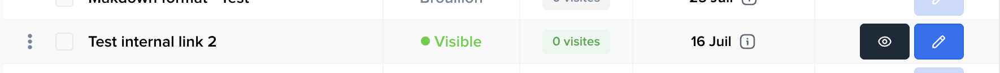

# react-native-crisp-chat-sdk

React-Native bridge for Crisp chat iOS and Android SDK&#39;s


## Features

- iOS & Android Support
- Push Notifications support
- Typescript Support
- [Expo](/plugin/install.md) support with custom dev client

## Installation

Install the library using either yarn or npm:

```sh
yarn add react-native-crisp-chat-sdk
```

```sh
npm install react-native-crisp-chat-sdk
```

### Expo Workflow

This package supports Expo with a custom dev client. Since it wraps native iOS and Android SDKs, it is not available in Expo Go.

For detailed setup instructions, see the [Expo installation guide](/plugin/install.md).

### React Native (Bare Workflow)

#### Android

```sh
npm run android
```

#### iOS

```sh
cd ios && pod install
```

```sh
npm run ios
```

## Get your website ID

Your website ID can be found in the Crisp App URL:

- https://app.crisp.chat/website/[WEBISTE_ID]/inbox/

Crisp Website ID is an UUID like e30a04ee-f81c-4935-b8d8-5fa55831b1c0

## Push Notifications Support

### Expo

When using Expo, push notifications are easy to set up and are covered in detail in the [Expo installation guide](/plugin/install.md#push-notifications-optional).

### React Native CLI

When using React Native CLI, you will need to manually add custom handlers in the Android and iOS packages. The procedures are detailed in the Crisp Developer Hub for both [iOS](https://docs.crisp.chat/guides/chatbox-sdks/ios-sdk/#5-implement-push-notifications-optional) and [Android](https://docs.crisp.chat/guides/chatbox-sdks/android-sdk/#2-enable-push-notifications-in-crisp-dashboard).

## Usage

You can view the [example project](./example/src/App.tsx) for more usage.

### Important Notes on Token Management

**setTokenId should be called before the chat has been presented.** If you want to change the token after the chat has been presented, you need to call `resetSession()` for the new token to come into effect.

**When users logout from their account in your app, make sure to clear the token by calling `setTokenId(null)` and then reset their local session by calling `resetSession()`.** This will not destroy the remote session with Crisp, it will only unbind the app from it. This session will be recovered when the user logs in again to their account, via their token.

**Example of logout handling:**

```js
const userLogout = () => {
  // Execute this sequence when your users are logging out
  setTokenId(null); // 1. Clear the token value
  resetSession(); // 2. Unbind the current session
};
```

```js
import CrispChat, {
  configure,
  setUserEmail,
  setUserNickname,
  setUserPhone,
  setUserCompany,
  setSessionSegments,
  resetSession,
  getSessionIdentifier,
} from 'react-native-crisp-chat-sdk';

// ...
export default function App() {
  // You must set your website ID before calling <CrispChat />
  configure('YOUR_WEBSITE_ID');

  // this should be user ID that way app will load previous user chats
  setTokenId('abcd12345');

  // Set user's info
  setUserEmail('test@test.com'); // Without identity verification
  setUserNickname('John Smith');
  setUserPhone('+614430231224');

  // Set user's company information
  setUserCompany({
    name: 'Acme Corporation',
    url: 'https://acme.com',
    companyDescription: 'Best company in the world',
    employment: {
      title: 'Software Engineer',
      role: 'Developer'
    },
    geolocation: {
      city: 'Paris',
      country: 'FR'  // ⚠️ Use country codes (FR, US, DE, etc), not full names
    }
  });
  // Set session segments
  setSessionSegments(['premium', 'mobile']);

  // Get current session identifier (returns null if session not yet loaded)
  const sessionId = await getSessionIdentifier();
  console.log('Current session ID:', sessionId);

  // Call session reset when user logs out
  resetSession();

  return <CrispChat />;
}
```

### User Company Information

You can set detailed company information for users, including employment details and geolocation:

```js
import { setUserCompany } from 'react-native-crisp-chat-sdk';

setUserCompany({
  name: 'Acme Corporation', // Required: Company name
  url: 'https://acme.com', // Optional: Company website
  companyDescription: 'Best company ever', // Optional: Company description
  employment: {
    // Optional: User's employment info
    title: 'Software Engineer',
    role: 'Senior Developer',
  },
  geolocation: {
    // Optional: Company location
    city: 'San Francisco',
    country: 'US', // ⚠️ Use country codes (US, FR, etc), not full names
  },
});
```

Type definitions available to developers:

```ts
export interface Employment {
  title?: string;
  role?: string;
}

export interface Geolocation {
  country?: string; // ⚠️ Must be country code (US, FR, DE, etc), not full country name
  city?: string;
}

export interface Company {
  name: string;
  url?: string;
  companyDescription?: string;
  employment?: Employment;
  geolocation?: Geolocation;
}
```

**⚠️ Important:** For the `country` field in `geolocation`, use **country codes** (ISO 3166-1 alpha-2 format) like `"US"`, `"FR"`, `"DE"`, etc. Full country names like `"France"` or `"United States"` will not work.

### Identity Verification

Identity verification is supported. You can set a user's email with or without verification:

```js
import { setUserEmail } from 'react-native-crisp-chat-sdk';

// Without identity verification (simple case)
setUserEmail('user@example.com');

// With identity verification (secure case)
setUserEmail('user@example.com', 'backend-generated-signature');
```

To use identity verification, follow the official Crisp documentation and pass the backend-generated signature as the second parameter.

Official docs: https://docs.crisp.chat/guides/chatbox-sdks/web-sdk/identity-verification/

### Session Management

#### Setting Session Segments

You can set multiple session segments to categorize user sessions. Segments help organize and filter conversations in your Crisp dashboard.

```js
import {
  setSessionSegments,
  setSessionSegment,
} from 'react-native-crisp-chat-sdk';

// Set multiple segments at once
setSessionSegments(['premium', 'mobile', 'ios']);

// Set multiple segments with overwrite (replaces existing segments)
setSessionSegments(['vip', 'web'], true);

// Set a single segment (adds to existing segments)
setSessionSegment('trial');
```

**About the `overwrite` parameter:**

- `overwrite: false` (default) - Adds new segments to existing ones
- `overwrite: true` - Replaces all existing segments with the new ones

**Example scenarios:**

```js
// User upgrades to premium
setSessionSegments(['premium', 'mobile'], true); // Replaces all segments

// User completes onboarding
setSessionSegments(['onboarded']); // Adds to existing segments
```

#### Getting Session Identifier

You can retrieve the current session identifier to track user sessions or for analytics purposes:

```js
import { getSessionIdentifier } from 'react-native-crisp-chat-sdk';

// Get current session identifier
const getCurrentSession = async () => {
  try {
    const sessionId = await getSessionIdentifier();
    if (sessionId) {
      console.log('Current session ID:', sessionId);
      // Session is loaded and active
    } else {
      console.log('No active session yet');
      // Session not yet loaded (normal state)
    }
  } catch (error) {
    console.error('Error getting session identifier:', error);
    // Handle actual errors (network issues, etc.)
  }
};
```

**Important Notes:**

- Returns `null` when the session is not yet loaded (normal state)
- Returns a string identifier when the session is active
- Throws an error only for actual problems (network issues, etc.)
- The session identifier is unique per user session

### Helpdesk

Use the Helpdesk APIs to open Crisp Helpdesk directly from your app.

```js
import {
  searchHelpdesk,
  openHelpdeskArticle,
} from 'react-native-crisp-chat-sdk';

// Open Helpdesk search UI
searchHelpdesk();

// Open a specific Helpdesk article by slug and locale
openHelpdeskArticle('my-article-slug', 'en');

// Optionally override title/category displayed by Crisp
openHelpdeskArticle('my-article-slug', 'fr', 'title', 'category');
```

#### Finding Article Parameters

To get the required parameters for `openHelpdeskArticle()`, follow these steps in your Crisp workspace:

1. Go to your Crisp web app (SaaS platform)
2. Navigate to your workspace
3. Select "Helpdesk" from the sidebar
4. Choose an article and click the eye icon to view it :



5. From the article URL, extract the parameters:

For example, with URL: `https://staging.crisp.help/fr/article/test-internal-link-2-6hkgyg/?bust=1755758362140`

- `id`: `6hkgyg` (the article slug at the end)
- `locale`: `fr` (the language code in the URL path)
- `title`: Optional - custom title to display (defaults to article's actual title)
- `category`: Optional - custom category to display (defaults to article's actual category)

#### Notes

- Both functions will automatically open the chat UI if it is not already open.
- `openHelpdeskArticle(id, locale, title?, category?)` expects the article slug as `id` and an IETF language tag for `locale` (e.g. `en`, `fr`).

### Bot Scenarios

Trigger Crisp Bot Scenarios programmatically to automate conversation flows and provide guided experiences.

```js
import { runBotScenario } from 'react-native-crisp-chat-sdk';

// Trigger a bot scenario by its ID
runBotScenario('welcome-flow');
```

#### Finding Scenario IDs

To get the scenario ID for `runBotScenario()`, follow these steps in your Crisp workspace:

1. Go to your Crisp web app (SaaS platform)
2. Navigate to your workspace
3. Select "Bot" from the sidebar
4. Choose "Scenarios" from the bot menu
5. Click on the scenario you want to trigger
6. Copy the scenario ID from the URL or scenario settings

#### Notes

- The scenario will be triggered immediately when the function is called
- Ensure the chat is configured and the user session is active before calling
- Bot scenarios work best when the chat UI is visible to the user

## Language management

Explicitly setting alternative languages from React is not currently supported. Nevertheless, the underlying SDK is able
to select automatically the locale matching the one of device. The locale detection works out-of-the-box on Android.
However, for the locale of the device to be detected on iOS apps, it has to be declared and setup in xcode as a
supported language.

Here is a suggested method for adding languages support to your app in Xcode 13:

Start by adding support for your particular language in your project info (`<yourProject>` > `Info` > `Localizations` >
`+`). To make it active, you also need to create at least one dummy StringFile (`File` > `New` > `File...`) with a
localized version matching the language you wish to add support to. After this step, if the locale of the device matches
the language you set up, it will be exposed by the app and chosen by the Crisp SDK. Note that alternative methods may
exist, but have not been tested regarding the locale detection of the Crisp SDK.

For iOS apps, debugging the preferred language exposed by your app can be achieved by adding the following line in your
AppDelegate.m file : `NSLog(@"localeIdentifier: %@", [[NSLocale currentLocale] localeIdentifier]);`

If for example, `localeIdentifier: en_FR` or `localeIdentifier: en_US` appears in your Xcode logs, then Crisp will be
displayed in english. If `localeIdentifier: fr_FR` appears in your Xcode logs, it will be displayed in french.

## Available APIs:

- `CrispChatSDK.show()`
- `CrispChatSDK.setTokenId('userID/GUID')` - **Must be called before chat is presented**
- `CrispChatSDK.pushSessionEvent(name: "Signup", color: CrispSessionEventColors.blue)`
- `CrispChatSDK.setUserEmail('test@test.com')` - **Identity verification signature is optional**
- `CrispChatSDK.setUserEmail('test@test.com', 'signature')` - **With identity verification**
- `CrispChatSDK.setUserNickname('John Doe')`
- `CrispChatSDK.setUserPhone('003370123456789')`
- `CrispChatSDK.setUserCompany(company: Company)` - **Set user company information**
- `CrispChatSDK.setUserAvatar('https://pbs.twimg.com/profile_images/782474226020200448/zDo-gAo0_400x400.jpg')`
- `CrispChatSDK.setSessionSegment('segment')`
- `CrispChatSDK.setSessionSegments(['segment1', 'segment2'], overwrite?: boolean)`
- `CrispChatSDK.setSessionString('key', 'value')`
- `CrispChatSDK.setSessionBool('key', 'value')`
- `CrispChatSDK.setSessionInt('key', 'value')`
- `CrispChatSDK.getSessionIdentifier()` - **Returns Promise<string | null>**
- `CrispChatSDK.resetSession()` - **Use after logout or when changing tokens**
- `CrispChatSDK.configure('YOUR_WEBSITE_ID')`
- `CrispChatSDK.searchHelpdesk()`
- `CrispChatSDK.openHelpdeskArticle(id: string, locale: string, title?: string, category?: string)`
- `CrispChatSDK.runBotScenario(scenarioId: string)`

## Contributing

See the [contributing guide](CONTRIBUTING.md) to learn how to contribute to the repository and the development workflow.

## License

MIT
