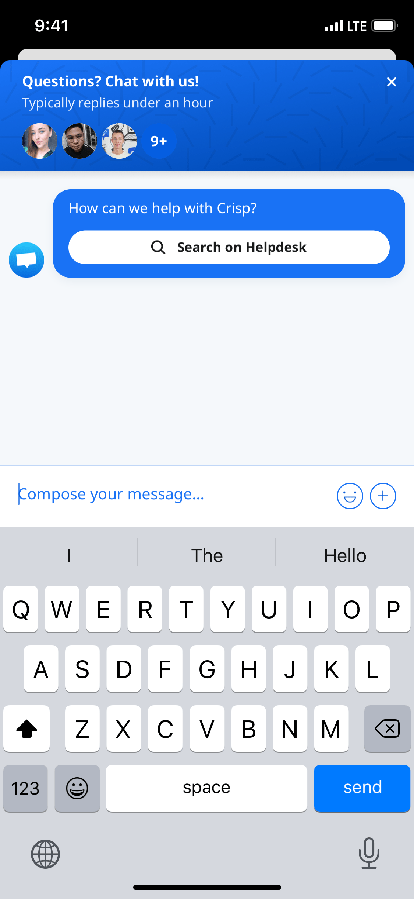

# react-native-crisp-chat-sdk

React-Native bridge for Crisp chat iOS and Android SDK&#39;s



## Features

- iOS & Android Support (In beta)
- Typescript Support

## Installation

Install the library using either yarn or npm like so:

```sh
yarn add react-native-crisp-chat-sdk
```

```sh
npm install --save react-native-crisp-chat-sdk
```

### iOS Installation

If you're using React Native versions > 60.0, it's relatively straightforward.

```sh
cd ios && pod install
```

For versions below 0.60.0, use rnpm links

- Run `react-native link react-native-crisp-chat-sdk`
- If linking fails, follow the
  [manual linking steps](https://facebook.github.io/react-native/docs/linking-libraries-ios.html#manual-linking)

### iOS

Start using Crisp by adding the following code on your AppDelegate :

```objective-c
#import <Crisp/Crisp.h>

[CrispSDK configureWithWebsiteID:@"YOUR_WEBSITE_ID"];
```

#### Update your Info.plist

To enable your users to take and upload photos to the chat as well as download photos to their photo library, add the
`Privacy - Camera Usage Description` ([NSCameraUsageDescription](https://developer.apple.com/documentation/bundleresources/information_property_list/nscamerausagedescription)) and `Privacy - Photo Library Additions Usage Description` ([NSPhotoLibraryAddUsageDescription](https://developer.apple.com/documentation/bundleresources/information_property_list/nsphotolibraryaddusagedescription)) to your app's Info.plist.

#### Additional Steps

This library was written in Swift, so in-order for you app to compile, you need to have at least one .swift file in your source code a bridging header to avoid a runtime error like so:


All you have to do is:

- File > New > File
- Swift File
- Name the file whatever you wish
- When prompted to create a bridging header, do so

### Android

Add the Crisp SDK in your dependencies in `app/build.gradle`:

```groovy
implementation 'im.crisp:crisp-sdk:1.0.0beta0'
```

Initialize the library in your [Application subclass](https://github.com/facebook/react-native/blob/master/template/android/app/src/main/java/com/helloworld/MainApplication.java)

```java
import im.crisp.client.Crisp;

public class MainApplication extends Application implements ReactApplication {

    @Override
    public void onCreate() {
        super.onCreate();

        // Replace it with your WEBSITE_ID
        // Retrieve it using https://app.crisp.chat/website/[YOUR_WEBSITE_ID]/
        Crisp.configure("YOUR_WEBSITE_ID");
    }
}
```

## Requirements

⚠️ Adding Camera and Photo permissions is mandatory, `NSCameraUsageDescription` and `NSPhotoLibraryUsageDescription` in `Info.plist`, to inform your users that you need to access to the Camera and Photo Library. You also have to enable **"iCloud Documents"** capability

## Get your website ID

Your website ID can be found in the Crisp App URL:

- https://app.crisp.chat/website/[WEBISTE_ID]/inbox/

Crisp Website ID is an UUID like e30a04ee-f81c-4935-b8d8-5fa55831b1c0

## Usage

You can view the [example project](./example/src/App.tsx) for more usage.

```js
import CrispChat, { setUserEmail } from 'react-native-crisp-chat-sdk';

// ...
export default function App() {
  setUserEmail('test@test.com');

  return (
    <CrispChat />;
  )
}
```

## Availables APIs:

- `CrispChatSDK.show()`
- `CrispChatSDK.setTokenId('XXXX')` (iOS only)
- `CrispChatSDK.pushSessionEvent(name: "Signup", color: CrispSessionEventColors.blue)` (iOS only)
- `CrispChatSDK.setUserEmail('test@test.com')` (iOS only)
- `CrispChatSDK.setUserNickname('John Doe')` (iOS only)
- `CrispChatSDK.setUserPhone('003370123456789')` (iOS only)
- `CrispChatSDK.setUserAvatar('https://pbs.twimg.com/profile_images/782474226020200448/zDo-gAo0_400x400.jpg')` (iOS only)
- `CrispChatSDK.setSessionSegment('segment')` (iOS only)
- `CrispChatSDK.resetSession()` (iOS only)

## Contributing

See the [contributing guide](CONTRIBUTING.md) to learn how to contribute to the repository and the development workflow.

## License

MIT
